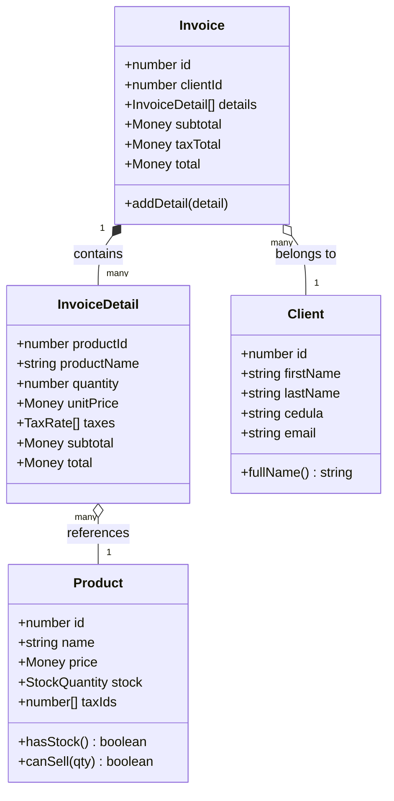
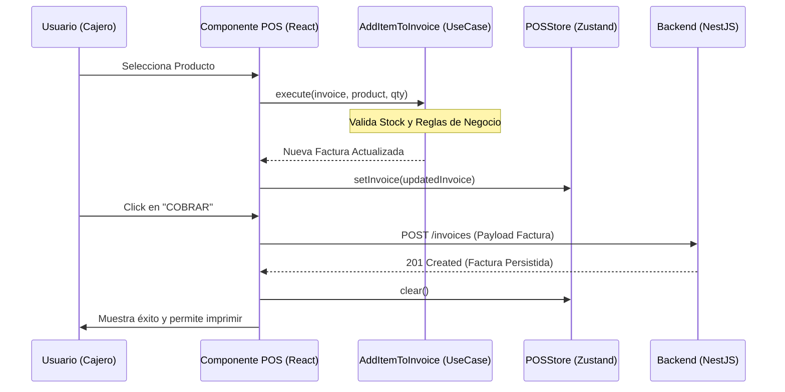

# Frontend Architecture Diagrams (POS)

## Class Diagram (Core Entities & POS Flow)
Este diagrama representa cómo se relacionan las entidades de dominio en el frontend y cómo fluyen los datos hacia la vista de Punto de Venta.

## Sales Flow (POS Sequence)
Describe el proceso desde que se selecciona un producto hasta que se finaliza la venta.

